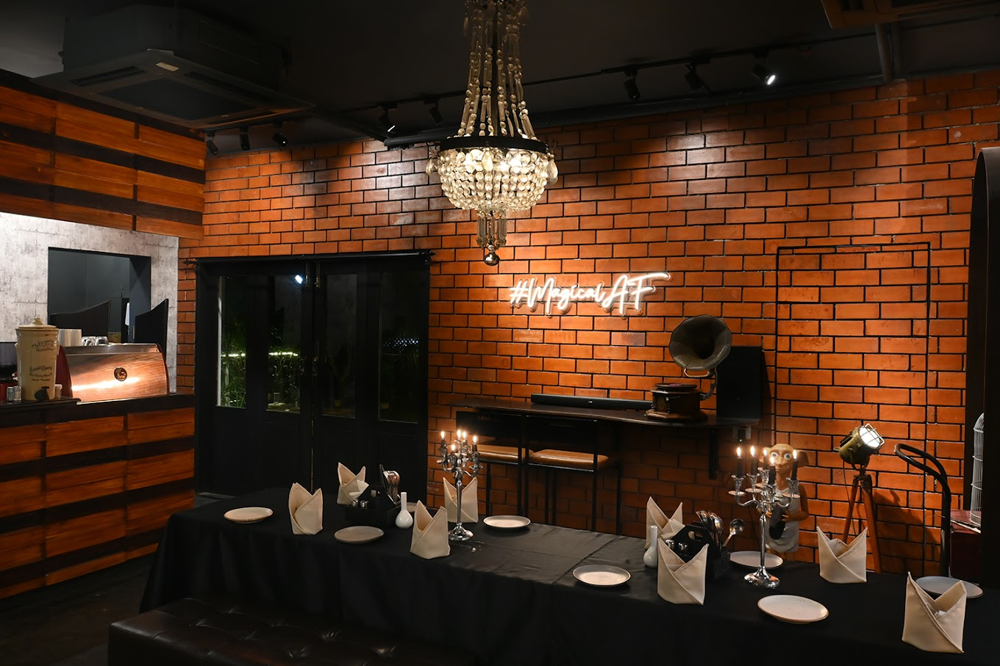

# Ex.07 Restaurant Website
## Date: 20-12-24

## AIM:
To develop a static Restaurant website to display the food items and services provided by them.

## DESIGN STEPS:

### Step 1:
Requirement collection.

### Step 2:
Creating the layout using HTML and CSS.

### Step 3:
Updating the sample content.

### Step 4:
Choose the appropriate style and color scheme.

### Step 5:
Validate the layout in various browsers.

### Step 6:
Validate the HTML code.

### Step 7:
Publish the website in the given URL.

## PROGRAM:
```
index.html
<!DOCTYPE html>
<html lang="en">
<head>
    <meta charset="UTF-8">
    <meta name="viewport" content="width=device-width, initial-scale=2.0">
    <title>The Old Potion House</title>
    <link rel="stylesheet" href="styles.css">
</head>
<body>
    <header>
        <div class="logo">
            <h1>The Old Potion House</h1>
        </div>
        <nav>
            <ul>
                <li><a href="index.html">Home</a></li>
                <li><a href="menu.html">Menu</a></li>
                <li><a href="contact.html">Contact Us</a></li>
            </ul>
        </nav>
    </header>
    
    <section class="hero">
        
        
    </section>

    <section class="about">
        <h2>Welcome to The Old Potion House</h2>
        <p>Come and experience our magical ambiance, where each dish is brewed with care and the finest ingredients.</p>
    </section>

    <footer>
        <p>Website designed by Praveena Ashok</p>
    </footer>
</body>
</html>

menu.html
<!DOCTYPE html>
<html lang="en">
<head>
    <meta charset="UTF-8">
    <meta name="viewport" content="width=device-width, initial-scale=1.0">
    <title>Menu - The Old Potion House</title>
    <link rel="stylesheet" href="styles.css">
</head>
<body>
    <header>
        <div class="logo">
            <h1>The Old Potion House</h1>
        </div>
        <nav>
            <ul>
                <li><a href="index.html">Home</a></li>
                <li><a href="menu.html">Menu</a></li>
                <li><a href="contact.html">Contact Us</a></li>
            </ul>
        </nav>
    </header>

    <section class="menu">
        <h2>Our Magical Menu</h2>
        <div class="menu-item">
            
            <h3>Enchanted Elixir</h3>
            <p>A blend of mystical herbs and fruits, sure to awaken your senses.</p>
            <p class="price">Rs.240</p>
        </div>
        <div class="menu-item">
            
            <h3>Witch's Brew</h3>
            <p>A dark, rich potion brewed to perfection for the adventurous soul.</p>
            <p class="price">Rs.360</p>
        </div>
        <div class="menu-item">
            
            <h3>Slytherin's Pasta</h3>
            <p>A richtastic Pasta awaiting for you.</p>
            <p class="price">Rs.290</p>
        </div>
        
    </section>

    <footer>
        <p>Website designed by Praveena Ashok</p>
    </footer>
</body>
</html>

styles.css
/* General Reset */
* {
    margin: 0;
    padding: 0;
    box-sizing: border-box;
}

/* Body and Layout */
body {
    font-family: "Times New Roman", Times, serif;
    background-color: #310377;
    color: #e70505;
    line-height: 1.6;
}

header {
    background-color: #310377;
    color: white;
    padding: 15px 0;
    text-align: center;
}

header .logo h1 {
    font-size: 2.5rem;
    margin: 0;
}

nav ul {
    list-style: none;
    padding: 0;
}

nav ul li {
    display: inline;
    margin: 0 15px;
}

nav ul li a {
    color: white;
    text-decoration: none;
    font-size: 1.1rem;
}

.hero {
    position: relative;
    text-align: center;
}

.hero .banner-img {
    width: 100%;
    height: 400px;
    object-fit: cover;
}

.hero-text {
    position: absolute;
    top: 50%;
    left: 50%;
    transform: translate(-50%, -50%);
    color: white;
    text-shadow: 2px 2px 5px rgba(0, 0, 0, 0.7);
}

.hero h2 {
    font-size: 3rem;
}

.hero p {
    font-size: 1.2rem;
}

.btn {
    background-color: #e94e77;
    color: white;
    padding: 10px 20px;
    text-decoration: none;
    border-radius: 5px;
    font-size: 1rem;
}

.btn:hover {
    background-color: #d14163;
}

.about {
    padding: 50px 20px;
    text-align: center;
}

.menu {
    display: flex;
    flex-wrap: wrap;
    justify-content: center;
    padding: 20px;
}

.menu-item {
    width: 250px;
    margin: 15px;
    text-align: center;
    background-color: white;
    border: 1px solid #ccc;
    border-radius: 8px;
    padding: 15px;
}

.menu-item img {
    width: 100%;
    border-radius: 8px;
}

.price {
    font-weight: bold;
    color: #e94e77;
}

.contact {
    padding: 50px 20px;
    text-align: center;
}

footer {
    background-color: #5014ab;
    color: white;
    text-align: center;
    padding: 10px 0;
}

```
## OUTPUT:


## RESULT:
The program for designing software company website using HTML and CSS is completed successfully.
